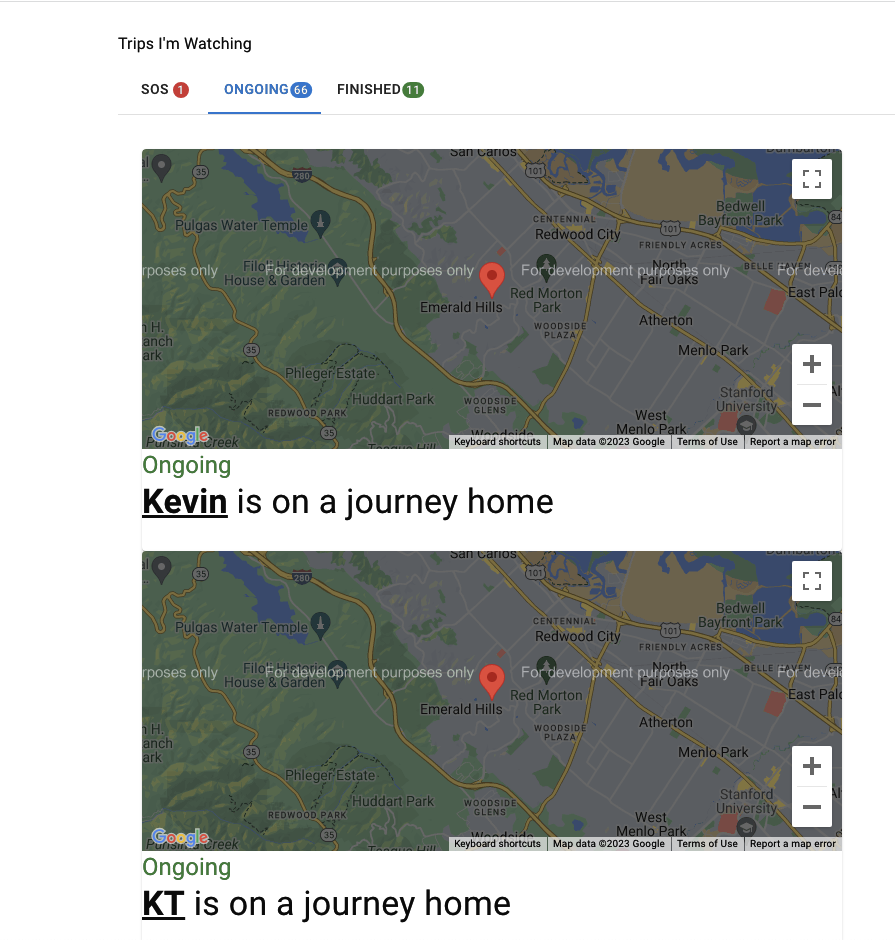
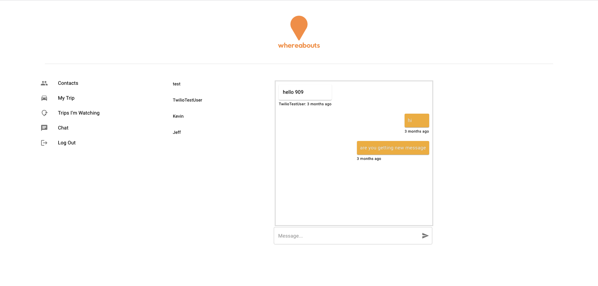

<p align="center">
  <h1 align="center"><b>WhereAbouts</b></h1>
</p>
<h2 align="center">
  An application that allows subscription of friend’s trips providing real time communication SMS alerts, chat messages, and geolocations.
</h2>
  
<!-- TABLE OF CONTENTS -->
<details open="open">
  <summary>Table of Contents</summary>
  <ol>
    <li><a href="#overview">Overview</a></li>
    <li><a href="#installation--getting-started">Installation / Getting Started</a></li>
    <li><a href="#functionality">Functionality / Features</a></li>
    <li><a href="#tech-stack">Tech Stack</a></li>
    <li><a href="#contributing">Contributing</a></li>
    <li><a href="#meet-our-team">Meet our Team</a></li>
  </ol>
</details>

## <b>Overview</b>

<p align="left">
Whereabouts is a social safety check application that users can use to alert family and friends of their physical geolocation. Through the application, users can follow each other via  phone numbers and share locations via Google Maps, providing live updates through their shared coordinates and the chat room functionality.
</p>

## <b>Installation / Getting Started</b>

After following installation steps perform the following:

1. Clone the whereabouts-v2 repository onto the user's local machine.
2. Open whereabouts-v2 repo in Visual Studio Code.
3. Run the following command in the terminal. This will npm install node modules in the root, client, and server folders:

```
npm install && cd TS_src/client && npm install && cd ../server && npm install
```
   
4. Run `npm run dev` in the root directory.
5. Run `http://localhost:3000/` on your browser to start sharing locations with your friends!

## <b>Functionality / Features</b>

### Adding Contacts

Users can search and add other users to their contacts list by phone number. Users can then share trip information with selected contacts with the check box.


### Tracking Trips

In the "Trips I'm Watching" tab, users can monitor the status of trips their contacts have shared with them. Trips are sorted into three status types and each trip shows the designated destination. Trip updates, such as the start of a trip, the end of a trip, and SOS alerts, are also sent as text notifications to their contact's phone.



### Chat Messaging

Users can also message their contacts with the built-in real time chat service. Message history and chat time stamps are saved.



## <b>Tech Stack</b>

- [TypeScript]( https://www.typescriptlang.org/)
- [React](https://react.dev/)
- [Vite](https://vitejs.dev/)
- [Material-UI](https://mui.com/material-ui/)
- [PostgreSQL](https://www.postgresql.org/)
- [Node.js](https://nodejs.org)
- [Express](https://expressjs.com/)
- [Socket.io](https://socket.io/)
- [Twilio]( https://www.twilio.com/en-us)

## <b>Contributing</b>

This project was iterated upon the exisiting repository: [WhereAbouts](https://github.com/Whereabouts-Project-UN-KP-CC-LC/whereabouts/tree/dev).

As part of the open source community, we'd like to welcome those who'd like to contribute to this product. We released WhereAbouts in hopes of helping developers efficiently onboard new codebases. If you found this project useful, feel free to give it a star to help increase the visibility of this product. If you found any issues with this product, please report them with the 'Issues' tab or submit a PR.

Thank you!

  <p align="left">
      <a href="https://github.com/jktyy-whereabouts-v2/whereabouts-v2/issues">Report Bug / Request Feature</a>
  </p>

## <b>Meet Our Team</b>

- Jenny Schmalz • [LinkedIn](https://www.linkedin.com/in/jennyschmalz/) • [Github](https://github.com/jennyschmalz)
- Kevin Yoon • [LinkedIn](https://www.linkedin.com/in/kevinjyoon/) • [Github](https://github.com/kyoon0)
- Ted Chu • [LinkedIn](https://www.linkedin.com/in/tedcchu/) • [Github](https://github.com/tcchu)
- Yeong Sil Yoon • [LinkedIn](https://www.linkedin.com/in/yeong-sil-yoon/) • [Github](https://github.com/wendyys96)
- Yourui Ruan • [LinkedIn](https://www.linkedin.com/in/youruir/) • [Github](https://github.com/YouruiR)

